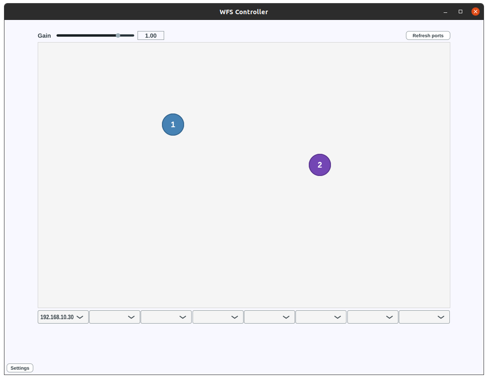

# teensy-wfs

Distributed WFS implementation for networked Teensy 4.1s.

Built upon on the [JackTrip client](https://github.com/hatchjaw/jacktrip-teensy) 
for Teensy, which is a submodule at [lib/jacktrip-teensy](lib/jacktrip-teensy).

---

## Building

### Faust

DSP is handled by a Faust algorithm. Consult the parameters in
[src/faust/WFS_Params.lib](src/faust/WFS_Params.lib), set them to match your
system, and run the following command:

```shell
./scripts/f2t ./src/faust/WFS.dsp
```

This will compile `WFS.dsp` to a Teensy audio library C++ class, which will be 
placed in `src/WFS`.

### Teensy

Define `AUDIO_BLOCK_SAMPLES` and `NUM_JACKTRIP_CHANNELS` to match the settings
on your JackTrip server. 

### PlatformIO

The above flags are set in [platformio.ini](platformio.ini).

To pull dependencies (_TeensyID_, for assigning a MAC and IP),
build and upload to a Teensy:

```shell
pio run -t upload
```

Or to multiple Teensies (requires [tytools](https://github.com/Koromix/tytools)):

```shell
./scripts/upload.sh
```

### Arduino IDE

You can define `NUM_JACKTRIP_CHANNELS` in `src/main.cpp`, but not (as far as
I'm aware) `AUDIO_BLOCK_SAMPLES`; you may need to make a
`platform.local.txt` for your Arduino environment to set that flag.

Anyway, create a sketch, copy `src/main.cpp` into the `.ino` file, and add 
`src/WFS/*` to that sketch. Open the library manager and add the _TeensyID_ 
library. Download a .zip of the `jacktrip-teensy` repository, and import that 
into the IDE (Sketch > Include Library > Add .ZIP Library...). Select Teensy 
4.1 as your board and click _Upload_.

## Running

On boot, the Teensy WFS modules will attempt to initiate a connection to a 
JackTrip server at `192.168.10.10`, which is assumed to be a regular computer,
connected via ethernet to a switch, to which Teensy modules are in turn 
connected.
This is the address you should assign to the wired network adapter of the 
JackTrip server, using manual IPv4 config (i.e. no DHCP).

Run JackTrip as a hub server, with minimal queue buffer, no autopatching,
and as many IO channels as defined when you uploaded to your Teensies:

```shell
jacktrip -S -q2 -p5 -n[NUM_JACKTRIP_CHANNELS]
```

For further detail on setting up the server and running Teensy as a 
JackTrip client, see the 
[readme](https://github.com/hatchjaw/jacktrip-teensy/blob/main/README.md) for 
the `jacktrip-teensy` repository.

---

## WFS Control Application

There is a WFS Controller JUCE app in the [wfs-controller](wfs-controller)
directory; head there for build instructions. 
The WFS controller uses JACK's C API to set up ports and connect to any
Teensy JackTrip clients. It notifies the clients of their positions in the
WFS array, plus the positions of virtual sound sources, via OSC over UDP
multicast.

